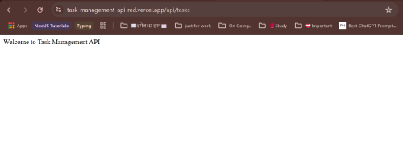

- [Link](#https://task-management-api-red.vercel.app/api/tasks)

# Task Management API

**Task Management REST API** built using **Node.js**, **Express.js**, and **MongoDB**. It allows users to manage tasks efficiently by providing endpoints to create, retrieve, update, and delete tasks.

## Features

The Task Management API provides a backend solution for managing daily tasks in a structured manner.

- Create a new task
- Retrieve all tasks with filtering, sorting, and pagination
- Retrieve a single task by ID
- Update a task
- Update task status
- Delete a task

---

## 🛠️ Technologies Used

- **Node.js** – JavaScript runtime environment
- **Express.js** – Web framework for building RESTful APIs
- **MongoDB** – NoSQL database used for storing tasks
- **Mongoose** – ODM for MongoDB to interact with the database
- **Joi** – For input validation
- **Nodemon** – For automatic server restarts during development
- **env-cmd** – Loads environment variables from `.env` file

---

## 🚀 Setup Instructions

### 1. Clone the repository

```bash
git clone https://github.com/shahsuresh/task-management-api.git
cd task-management-api
```

### 2.Install dependencies

```bash
npm install
```

### 3. Create a .env file

```
PORT=3000
db_USER_NAME= userName
db_PASSWORD= password
db_HOST_NAME= dbName.vm6lwbl.mongodb.net
db_NAME= dataBase_Name
db_CLUSTER_NAME= clusterName
```

### 4. Run the server

```bash
npm run dev
```

The server will start at: http://localhost:3000

## 📫 API Endpoints

Base URL: http://localhost:3000/api/tasks

#### 📌Create New Task

Method: POST Endpoint: /add

```json
{
  "title": "Complete assignment",
  "description": "Complete the Express.js assignment",
  "status": "Pending"
}
```

#### 📌List Tasks with Pagination, Filtering & Sorting

Method: GET Endpoint: /task-list

```json
{
  "page": 1,
  "limit": 5,
  "status": "Pending", //optional
  "createdDate": "2025-04-11",
  "sortOrder": "asc"
}
```

#### 📌Get Task by ID

Method: GET Endpoint: /:id

#### 📌Update a Task

Method: PUT Endpoint: /update/:id

```json
{
  "title": "Updated title",
  "description": "Updated task description",
  "status": "In-Progress"
}
```

#### 📌 Update Task Status Only

Method: PATCH Endpoint: /:id/status

```json
{
  "status": "Completed"
}
```

#### 📌 Delete a Task

Method: DELETE Endpoint: /delete/:id

## API Deployment

The API is deployed on the following platform:

- 🚀 ** API URL**: [`https://task-management-api-red.vercel.app/api/tasks`](https://task-management-api-red.vercel.app/api/tasks)
- ☁️ **Hosted on**: Vercel

## 📸Screenshots

<div align="center">
  <h4>📸 Home Page</h4>

</hr>

</div>

## ✅ Validation & Error Handling

- Request bodies are validated using Joi schemas.

- Custom error messages are returned for better debugging.

- All endpoints return appropriate status codes and error descriptions.

## 📁 Folder Structure

├── index.js  
├── package.json  
├── .env  
└── src
├── controllers
│ └── task.routes.js  
 ├── db
│ └── dbConnection.js  
 ├── middleware  
 └── validations

## 👨‍💻 Author

Suresh Sah

#### Task Management API
